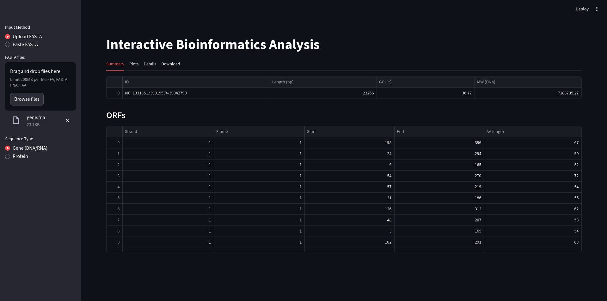

# SeqAnalyst
#### Your Personal Sequence Analysis Suite



## About

This is a Python code built with **Streamlit**. It creates an interactive bioinformatics web application which allows users to upload or paste FASTA sequences (DNA/RNA or protein) and performs various analyses.

For **single sequences**, it calculates properties like length, molecular weight, GC content, and identifies open reading frames (ORFs) for genes, or isoelectric point, aromaticity, and hydropathy for proteins. It also generates plots like 6-frame translation lengths for genes or amino acid composition and hydropathy profiles for proteins. Restriction enzyme maps and protein domains are also identified.

For **multiple sequences**, it calculates sequence similarity distances, performs hierarchical clustering (dendrogram), and visualizes relationships using PCA and UMAP. For gene sequences, it also shows GC content across sequences, and for all types, it generates a simple consensus sequence.

It's a **user-friendly tool for basic genomic and proteomic sequence analysis and visualization**.

## How to use

To use this bioinformatics web application, you would run the Python script locally.

1.  **Prerequisites:**

      * **Git Installed:** You need Git installed on your system to interact with GitHub repositories.
      * **Python Installed:** Python 3 (preferably 3.8+) should be installed.
      * **Internet Connection:** To download the repository and its dependencies.

2.  **Cloning the Repository:**

      * Open terminal or command prompt.
      * Navigate to the directory where they want to save the project (e.g., their `Documents` or `Projects` folder).
      * Use the `git clone` command followed by your repository's HTTPS URL:
        ```bash
        git clone https://github.com/kssrikar4/SeqAnalyst.git
        ```
      * This command creates a new folder named `SeqAnalyst` in their current directory, containing all the files from your GitHub repository.

3.  **Navigating to the Project Directory:**

      * After cloning, you need to change your current directory to the newly cloned project folder:
        ```bash
        cd SeqAnalyst
        ```

4.  **Installing Dependencies:**

      * Install all necessary libraries with a single command from within the `SeqAnalyst` directory:
        ```bash
        pip install -r requirements.txt
        ```
      * **Best Practice (Virtual Environments):** Encourage users to create a [Python virtual environment](https://docs.python.org/3/library/venv.html) *before* installing dependencies to avoid conflicts with other Python projects.
        ```bash
        python -m venv venv
        # On Windows:
        .\venv\Scripts\activate
        # On macOS/Linux:
        source venv/bin/activate
        pip install -r requirements.txt
        ```

5.  **Running the Streamlit Application:**

      * After dependencies are installed, you can run the application.
        ```bash
        streamlit run SeqAnalyst.py
        ```
        
6.  **Accessing the Web Interface:**

      * The terminal will provide a local URL (e.g., `http://localhost:8501`). Open this URL in their web browser to interact with the application.

7.  **Interact with the Application:**

      * **Sidebar Controls (Left Panel):**

          * **Input Method:** Choose between "Upload FASTA" (to select `.fa`, `.fasta`, `.fna`, or `.faa` files from your computer) or "Paste FASTA" (to manually paste FASTA formatted sequence text into the text area).
          * **Sequence Type:** Select whether your input sequences are "Gene (DNA/RNA)" or "Protein". This determines the type of analysis performed.

      * **Main Display Area:**

          * Once you provide sequences and select their type, the main area will populate with results.
          * **Single Sequence Analysis:** If you input only one sequence, it will show tabs like "Summary," "Plots," "Details," and "Download" with specific information (e.g., 6-frame translation for genes, hydropathy plots for proteins).
          * **Multiple Sequence Analysis:** If you input more than one sequence, it will display "Stats," "Plots," and "Consensus" tabs, providing comparative metrics, distance matrices, clustering visualizations (dendrogram, PCA, UMAP), and a consensus sequence.

      * **Viewing Results:** Click through the different tabs to explore the various outputs, dataframes, and plots generated by the analysis.
  
## Information presented in each analysis mode:

### Single Sequence Analysis Tabs:

When you input just one sequence (either DNA/RNA or Protein), the application provides detailed insights specific to that single molecule, organized into the following tabs:

1.  **Summary:**
    * **Purpose:** Provides fundamental quantitative characteristics of the sequence.
    * **Gene (DNA/RNA):** Displays metrics like `ID`, `Length (bp)` (base pairs), `GC (%)` (percentage of Guanine and Cytosine bases), and `MW (DNA)` (molecular weight in Daltons).
    * **Protein:** Displays `ID`, `Length` (amino acids), `MW (Da)` (molecular weight in Daltons), `pI` (isoelectric point, the pH at which the molecule carries no net electrical charge), `Aromaticity` (proportion of aromatic amino acids), `Instability` (index predicting protein stability), and `Gravy` (Grand Average of Hydropathicity, indicating overall hydrophobicity).
    * **Additional for Proteins:** Also shows a table with the **Amino Acid Percentage (`AA%`)** composition.
    * **Additional for Proteins:** Displays a table of **`Domains`** (N-gly, PKC, CK2, Ploop) found within the protein sequence based on regular expression patterns.

2.  **Plots:**
    * **Purpose:** Visual representations of key sequence features.
    * **Gene (DNA/RNA):** Shows a bar chart titled "**6-Frame Lengths**," indicating the lengths of translated protein sequences in all six possible reading frames (three forward and three reverse).
    * **Protein:** Shows two plots: "**AA Composition**" (a bar chart of amino acid percentages) and "**Hydropathy**" (a line plot showing the Kyte-Doolittle hydropathy index along the sequence, indicating hydrophobic/hydrophilic regions).

3.  **Details:**
    * **Purpose:** Provides raw or more technical output that might not fit in summary tables or plots.
    * **Gene (DNA/RNA):** Displays the `RC` (Reverse Complement) sequence and the `Score` (pairwise alignment score of the sequence with itself, usually 1 for self-alignment). Crucially, it also presents a "**Restriction map**" as a table, listing common restriction enzymes and the positions (`Sites`) where they cut the DNA.
    * **Protein:** Displays the `Score` (pairwise alignment score of the protein with itself).

4.  **Download:**
    * **Purpose:** Allows users to export the summarized data for external use.
    * **Both Gene & Protein:** Provides a button to "Download CSV" for the main summary `DataFrame`.

### Multiple Sequence Analysis Tabs:

When you input two or more sequences (of the same type, either all DNA/RNA or all Protein), the application performs comparative analyses across them, presented in these tabs:

1.  **Stats:**
    * **Purpose:** Provides comparative metrics and relationships between all input sequences.
    * **`Stats` Table:** Displays general statistics for each sequence (e.g., `ID`, `Length (bp)` for genes, `Length` for proteins, and `GC%` for genes).
    * **`Distance` Table:** A square matrix showing the pairwise "distance" (calculated as `Max_Alignment_Score - Actual_Alignment_Score`) between every pair of sequences. A lower value indicates higher similarity.

2.  **Plots:**
    * **Purpose:** Visualizes the relationships and groupings among multiple sequences based on their features.
    * **`Dendrogram`:** A tree-like diagram showing the hierarchical clustering of sequences based on their pairwise distances. Similar sequences are grouped closer together. (Appears if n>2 sequences).
    * **`Distance Heatmap`:** A color-coded matrix visually representing the pairwise distances between sequences, complementing the `Distance` table. Darker colors typically indicate closer relationships.
    * **`GC% Bar Chart` (for Genes):** A bar chart comparing the GC content of each gene sequence.
    * **`PCA` (Principal Component Analysis):** A 2D scatter plot showing the sequences projected into a lower-dimensional space. Sequences that are closer on this plot are more similar in their underlying features (k-mer frequencies for genes, amino acid composition for proteins). (Appears if the feature matrix has at least 2 dimensions).
    * **`UMAP` (Uniform Manifold Approximation and Projection):** Another 2D scatter plot for dimensionality reduction. UMAP often reveals more intricate, non-linear relationships and distinct clusters compared to PCA. (Appears if n>2 and sufficient features for embedding).

3.  **Consensus:**
    * **Purpose:** Provides a representative sequence derived from the input sequences.
    * **Consensus Sequence:** Displays a single sequence that represents the most common character (nucleotide or amino acid) at each position across all input sequences, after a simple alignment. This is a basic form of consensus generation, useful for quick insights into conserved regions.
